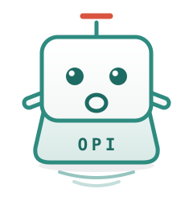
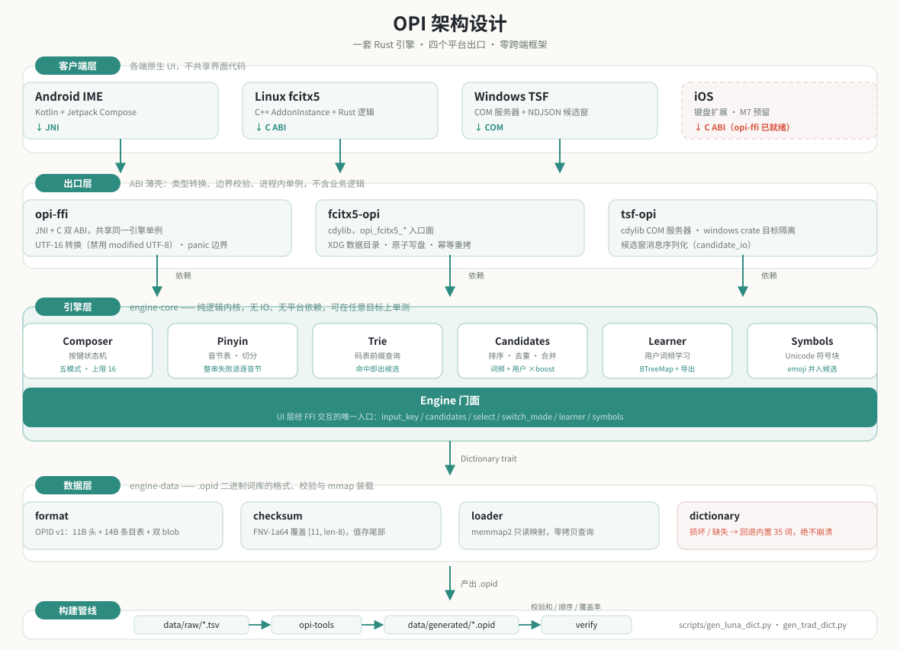
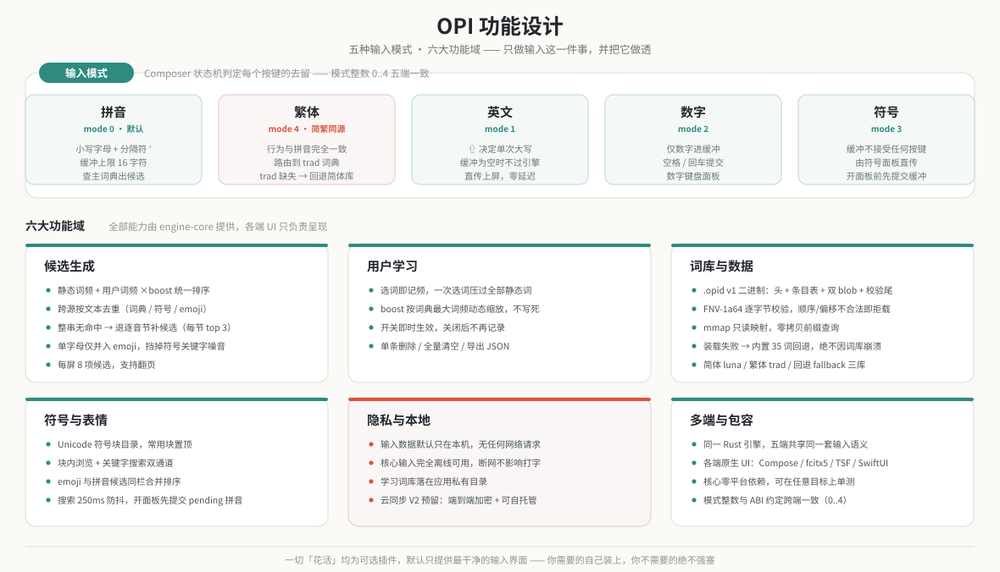
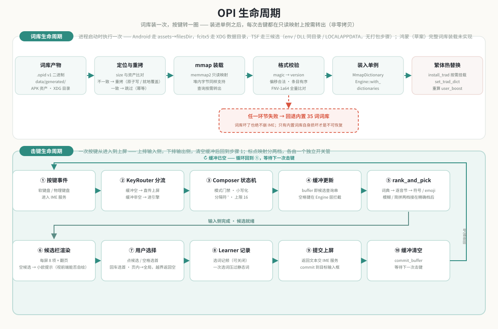

**[中文](README.md) · English**

# Open People Input (OPI)

## An input method that goes back to the basics — for everyone, on every device



### 🐾 Meet Opi

**Opi** is OPI's project pet — a **keycap sprite**.

It looks like a single key on a keyboard, because that is what an input method ought to be: nothing more.

| On its body | What it means |
|---|---|
| **Body = a keycap** | The essence of input. Never steals the spotlight; does one small thing |
| **Mouth = the letter O** | Open — open source, open dictionaries, auditable |
| **Antenna = the pinyin tone mark ˉ** | Pinyin input. Cinnabar red — the only warm colour on the whole figure |
| **Side legend = OPI** | The legend position on a keycap, and the project's name |
| **Ripples below** | The afterglow of a keypress, spreading only on this machine — it never leaves |

See [`docs/opi-pet.svg`](docs/opi-pet.svg) for the full figure (hand-written SVG, no external dependencies, scales to any size). It already lives inside the codebase:

- **Android settings page**: a Compose component, `OpiPet`, whose expression tracks engine state — idle / waiting / puzzled / asleep (turn learning off and it dozes)
- **Empty states**: on both the Android candidate bar and the Windows candidate window, Opi shrugs when pinyin yields no candidates, replacing what used to be a blank gap
- **The app launcher icon**: adaptive icon, pure VectorDrawable, no extra PNG density buckets
- **The `opi-tools` CLI**: prints a character-art Opi on a successful compile or verify (single-width characters only, so it never misaligns in a CJK terminal), and `--version` carries it too

Both Compose frontends (Android and the Windows candidate window) share a single [`shared/pet/OpiPet.kt`](shared/pet/OpiPet.kt). Not sharing UI code across platforms is a principle of this project — but the pet is one drawing, and two copies of the same geometry inevitably drift apart.

<br clear="right">

### 📖 Origin Story

**Born from frustration, built with passion.**

Input methods have become the digital "infrastructure" of daily life — and yet we find ourselves increasingly exasperated by the absurdity:

- You want to type a rare character, and you page through three screens of candidates without finding it
- You turn off every privacy switch, yet the input method still "helpfully" pushes ads for things you just chatted about
- The dictionary grows bigger, but the word you use most is always at the bottom
- Pop-ups, skin shops, AI assistants… so many features it's dizzying, and it still can't do the one thing that matters — typing well

We're not against iteration and evolution. The problem is that, in the race to become "big and comprehensive", many input methods have lost sight of their core mission — **making input itself simple, accurate, and efficient.**

And so **Open People Input** was born.

It's a serious rebellion born of "enough is enough" — and a gift to every user who is disappointed with the status quo.

### 🎯 What It Stands For

**Open People Input** is an **open, pure, cross-platform** input method, committed to giving every user an input experience that is **undisturbed, unobserved, and unconstrained.**

The name says it all:

| | Meaning |
|---|---|
| **Open** | Open engine, open dictionaries, transparent and auditable. No black boxes, no backdoors — your input data belongs to you alone. |
| **People** | Designed for everyone — whatever device you use, whatever language you speak, whatever special needs you have, you deserve equal input rights. |
| **Input** | Back to the essence of input. We don't steal the spotlight — we do one small thing, and we do it to perfection. |

### ✨ Core Features

> This section lists only what **actually runs in the code today**. Everything still on the wish list has been moved down into "🚧 Roadmap", each item labelled with its status. Earlier versions of this README mixed the two together and wrote both as if they were current fact; that is fixed here.

#### 1. One Engine, Native Clients per Platform
**The engine is written once.** `engine-core` is a pure-logic core with no IO and no platform dependencies — **the module list is whatever `crates/engine-core/src/lib.rs` declares as `pub mod`**, and the ones usually named are `Composer` state machine / `Pinyin` segmentation / `Trie` dictionary / `Candidates` ranking and merge / `Learner` / `Symbols` (**that is a reading guide, not a census** — jianpin `jianpin`, fuzzy pinyin `fuzzy`, punctuation `punctuation` and byte order `bytes` live on the same `pub mod` list). Above them sits a single `Engine` facade that the UI layer talks to. There is also a **platform-neutral key-routing layer** (`router.rs`'s `KeyRouter` + `keys.rs`'s keycode table), used by the Apple and HarmonyOS drafts through the C ABI — it lives here because it is pure logic; it is a **routing layer, not an engine module**, and its semantics follow the two existing tracks rather than inventing new ones. Above it sit three thin export shells (`opi-ffi` dual ABI · `fcitx5-opi` · `tsf-opi`), each holding one engine singleton per process.

**Three platforms have real client code**: Android (native Compose IME), Linux (fcitx5 plugin), and Windows (TSF plugin + Compose Desktop candidate window — the latter is a **separate UI codebase** talking to TSF over a named pipe). They share no UI code — only input semantics.

**The two Apple platforms and HarmonyOS currently have drafts only, no usable client** — three directories ([`ios/`](ios/), [`macos/`](macos/), [`harmony/`](harmony/)) hold Swift and ArkTS skeletons, but **not a line of them has ever been compiled** (this machine has neither macOS/Xcode/Apple SDK nor DevEco/HarmonyOS SDK — not even a syntax check is possible). **The only thing that is ready is the platform-neutral C ABI** (`crates/opi-ffi`, see `tests/cabi_test.rs`) — it belongs to no single client, and **has been measured to compile for several Apple and HarmonyOS targets**. See the Roadmap for each one's hard constraint.

#### 2. Privacy First — and You Can Check It Yourself
- **Local by default**: your input data stays on your machine. Neither the engine nor the export layer has a **HTTP client** in its dependency table — no telemetry, no ad SDK
- **Zero permissions**: the Android `AndroidManifest.xml` declares **not a single `uses-permission`**
- **Works offline**: core input runs fully offline; `.opid` dictionaries are read-only `mmap` maps, so the whole dictionary is never read into the heap (matching entries are materialised on demand at query time — `loader.rs`'s `MmapDictionary::query` calls `.to_string()` per hit and `candidates.rs`'s `rank_and_pick` clones again, so it is **not** zero-copy)

(Multi-device cloud sync has been **decided against** (user decision 2026-09-28) — see the Roadmap. **There is no sync or encryption code in the repository today.**)

#### 3. A Living Dictionary, With Gates Around It
- **Simplified + Traditional dictionaries**: `luna.opid` (Simplified) and `trad.opid` (Traditional); a missing traditional dictionary falls back to the simplified one. ⚠️ **Entry points today: only Android / iOS can reach Traditional** (`ImeScreen.kt` / `KeyboardViewController.swift`'s mode cycle); **macOS / Linux / Windows / Harmony have no entry** — their mode keys only cover Pinyin⇄English and Pinyin⇄Symbol (macOS and fcitx5's `Ctrl+'`, `tsf-opi/src/vk.rs`'s `mode_hotkey`), and on Linux CMake installs only `luna.opid`. The engine and data sides of Traditional are themselves complete
- **Full single-character coverage gate**: every GB2312 character is asserted to produce candidates (`trad_coverage` integration test; the character-count criterion lives inside the test). Break the coverage with a dictionary change and CI goes red
- **A broken dictionary never crashes the input method**: the loading policy is the same on every client — **a bad path always returns `Err` and never falls back silently** (the comment on `engine-data/src/dictionary.rs`'s `load_or_fallback` records that the earlier silent fallback was deliberately removed: the UI would believe a full dictionary had loaded), and the built-in fallback dictionary (`data/raw/fallback.tsv`; take its size from that file's line count) is used only when **no path is configured at all** (an empty string counts as none). Whether to recover from that `Err` is the caller's decision: Android's `EngineLoader` catches it and retries with the built-in dictionary (`EngineLoader.kt`'s `fallback()`), while fcitx5 and TSF propagate it (the load call sites in `fcitx5-opi/src/lib.rs` and `tsf-opi/src/tsf.rs`)
- **Dictionary distribution paths**: Android goes assets → filesDir (`EngineLoader.kt`), fcitx5 uses the XDG data directory and is installed by CMake (`fcitx5-opi/cpp/CMakeLists.txt`), and Windows tries `OPI_DICT_PATH` → the DLL's own directory → `%LOCALAPPDATA%\opi` → built-in fallback (`tsf-opi/src/dict_path.rs`). ⚠️ **Windows still has no packaging step**, so out of the box it still runs on the built-in fallback dictionary — the path exists, the copy does not
- **Community dictionaries**: the source data is plain text in `data/raw/*.tsv`; submit, review and merge via PR. Process and **licensing requirements** are in [`CONTRIBUTING.md`](CONTRIBUTING.md)

#### 4. No Feature Bloat
- The engine does one thing: a key state machine for five modes (Pinyin / Traditional / English / Number / Symbol) plus jianpin / fuzzy pinyin, candidate ranking, and local learning. No skin shop, no pop-ups, no AI assistant
- **Jianpin** (abbreviation-only input: `nh` → 你好, `zg` → 中国): **always on, with no switch** (same reasoning as fuzzy pinyin — fcitx5 and TSF have no configuration surface, so a switch would only make it impossible for those two to turn it off). The trigger condition, the expansion rules and the cap all live in the header comment of `engine-core/src/jianpin.rs`, and the gate is `tests/jianpin_ranking.rs`
- **The candidate total has no cap**: the `FETCH_LIMIT` truncation and the one inside `Engine::select` are both gone, and the three copies agree (`engine-core/src/router.rs` · `fcitx5-opi/src/candidate.rs` · `tsf-opi/src/logic.rs`, with equality assertions between them). ⚠️ **Two hosts still use the old cap**: Android (`EngineController.kt`'s `fetchLimit`) and macOS (`InputController.swift`'s `candidates(limit:)`, whose neighbouring comment still says "matches the Rust-side FETCH_LIMIT" — **now stale**) — neither can reach the engine-side paging exports; iOS and HarmonyOS go through `candidatesPage()` and never pass a limit from the front end
- **Two mechanisms that are ready while no client wires them**: first, **Chinese punctuation and fullwidth are two independent switches** (engine-side `chinese_punct` and `fullwidth` are separate, gate `tests/punctuation_switches.rs`; `set_chinese_punct` / `toggle_chinese_punct` and both ABI exports exist) — **but no client has an entry point**: the only caller in the whole repo is the JNI smoke table `android/jni_smoke/Main.java` (Android's `toggleFullwidth` likewise has that one caller). **The key binding is not in the engine layer** — the comment in `engine.rs` only *suggests* a tentative `Ctrl+/` for the two desktop tracks; it is not finalised and neither track implements it yet (that comment holds the reasoning and the measurements). Second, **persisting what was learned on the Rust side** (`engine-data/src/user_words.rs`, atomic write) has **zero callers in the whole repo**: Android persists through its own Kotlin `UserWordStore.kt`, while fcitx5 and TSF still drop it after every lesson
- Ranking has one counter-intuitive rule — **`limit` must not be pushed down into the dictionary query** (a learned low-frequency word can overtake one outside the cut-off). Details like this are where this project is fussy — see "Feature Design" below

### 🚧 Roadmap

Everything below is either part of the vision or a direction that has been **decided against**. Most items have **no corresponding code today**; a few are partially done (see the status column). It is listed to draw the boundary clearly, not as a schedule:

| Direction | Status | How we checked |
|---|---|---|
| **More platforms**: Web (incl. mini-apps) | Not started | grep for these platform names across the code and build scripts: zero hits (none in `docs/` either — only this README mentions them) |
| **HarmonyOS** | **Drafts only** (`harmony/`) | Same hard constraint as the two Apple platforms: **compiling it needs DevEco Studio + the HarmonyOS SDK, which this repo's verification environment (Linux) does not have — it cannot compile ArkTS, not even a syntax check**. The ArkTS under `harmony/` (`InputMethodExtensionAbility` and friends) **has never been through a compiler** — it is a starting point plus a contract. What *is* ready and measurable is the **Rust side**: the C ABI compiles for HarmonyOS targets (`cargo check --target aarch64-unknown-linux-ohos`, see the README in that directory) |
| **The two Apple platforms**: iOS · macOS | **Drafts only** (`ios/` · `macos/`) | **Hard constraint: both need macOS + Xcode to compile, and this repo's verification environment (Linux) cannot compile, link or run them — not even a Swift syntax check** (UIKit / InputMethodKit are Apple-only frameworks). The Swift in both directories **has never been through a compiler**; it is a starting point plus a contract, not a usable implementation. The only thing ready is the platform-neutral **C ABI** (`crates/opi-ffi`), and it **has been measured to compile for three Apple targets** (`cargo check --target aarch64-apple-ios / aarch64-apple-ios-sim / aarch64-apple-darwin` all pass, now in CI; it also produces an arm64 static library `libopi_ffi.a` with no missing exported symbols). **No Apple-side code should be treated as implemented until a compiler on a Mac has seen it** — this project has been burned twice already: the fcitx5 C++ and the Windows TSF both *read* as finished, yet testing showed neither had ever been compiled (the former had 7 wrong API calls, the latter never inserted text at all) |
| **Multi-device sync / end-to-end encryption** | **Not doing** (user decision 2026-09-28) | No encryption library, no HTTP client: across `crates/` `android/` `desktop/` (`*.rs` / `*.toml` / `*.kt`), `reqwest` / `ureq` / `hyper` / `openssl` / `rustls` / `chacha` / `argon2` / `aes-gcm` / `https://` each return zero hits. Every `sync` hit is a Rust synchronisation primitive or a TSF flag (`std::sync`, `TF_ES_SYNC`, `trad_assets_in_sync`) — unrelated to cloud sync. **Note**: the exported learning-dictionary JSON does carry a `version` field, but that is version negotiation for the **export format** (`learner.rs`'s `import_json` rejects `version != 1`) and has nothing to do with cloud sync |
| **More input schemes**: shuangpin · wubi · Cangjie · Bopomofo · custom rules | Reserved for V2 | `Mode`'s only variants are Pinyin / Traditional / English / Number / Symbol (take the list from `enum Mode` in `composer.rs`). The comment there mentions extending via `InputScheme` — **that type does not exist yet** |
| **English word association** | **Data only** | `docs/superpowers/specs/2026-08-12-opi-ime-design.md` says under "not doing in V1" that "V1 only does word association" — a promise made and never kept. The word source `data/raw/en_words.tsv` is now committed (origin, CC-BY 3.0 licence and upstream pin in `data/raw/LICENSES.md`, **which doubles as the attribution notice**); **the candidate logic is still unwired** — `candidates.rs` still returns an empty list for English and Number modes |
| **Accessibility**: screen readers | Partial (Android only) | The Android keyboard exposes basic screen-reader semantics: candidate changes are announced automatically (`liveRegion`), every key has a spoken name (no more reading out the glyph "⇧" / "⌫"), and the shift lock / one-shot state is readable. **Other platforms (Windows / Linux / iOS) are not covered** |
| **Voice input · scanning input** | Not started | Zero hits |
| **Minority languages and dialects**: Tibetan · Uyghur · Mongolian · Cantonese · Wu | Not started | Zero hits |
| **Plugin system**: every "extra" as an optional plugin | Not started | No plugin registry, no plugin interface, no dynamic loading — and there is nothing that needs a plugin yet |

### 🛠 Tech Stack

| Layer | Approach |
|---|---|
| **Core engine** | Pure Rust multi-crate workspace (`engine-core` / `engine-data` / `opi-tools`); **`engine-core` alone has no IO and no platform dependencies**, `engine-data` does the file mapping and byte parsing, and `opi-tools` is the compile CLI |
| **Export layer** | `opi-ffi` dual ABI (JNI + C) · `fcitx5-opi` (cdylib) · `tsf-opi` (cdylib COM server) — each holds one in-process engine singleton |
| **Client UI** | Native per platform, no cross-platform framework: Jetpack Compose on Android; a C++ AddonInstance calling Rust on Linux; TSF COM plus a Compose Desktop candidate window on Windows (NDJSON over a named pipe) |
| **Platform integration** | Android (InputMethodService), Linux (fcitx5), Windows (TSF), **iOS / macOS / HarmonyOS (drafts only — compiling them needs macOS + Xcode and DevEco + the HarmonyOS SDK respectively)** |
| **Data sync** | **Not doing** (user decision 2026-09-28): originally planned as end-to-end encryption + self-hosted support; we have decided **not to offer cloud sync and not to have accounts** — your data stays on your machine |
| **Versioning** | Single source of truth: `[workspace.package] version` in the root `Cargo.toml`, shared by every workspace member (the list is that file's `members`); Android `versionName` and desktop `packageVersion` align to it, and releases are tagged with the same number |

### 🧭 Architecture



**Five layers, dependencies pointing only downwards.** The lower the layer, the more stable; the higher, the closer to the user:

- **Client layer** — native UI per platform. The clients share no UI code, only input semantics.
- **Export layer** — thin ABI shells doing type conversion, boundary validation and panic isolation. Each process holds one engine singleton: on Android the settings page and the IME share the same Rust singleton, so toggling learning in settings takes effect in the IME immediately.
- **Engine layer** — `engine-core`, **pure logic, no IO, no platform dependencies**. This is the heart of the project and the easiest layer to test: `Composer` state machine / `Pinyin` segmentation / `Trie` dictionary / `Candidates` ranking and merge / `Learner` / `Symbols`, with **the full module list taken from `src/lib.rs`'s `pub mod`**; above them a single `Engine` facade that the UI layer talks to. The same layer also holds the **platform-neutral key routing** (`router.rs` / `keys.rs`), used by Apple and HarmonyOS through the C ABI — it is a routing layer rather than an engine module, and its semantics follow the two existing tracks.
- **Data layer** — the `.opid` binary dictionary: fixed-size header + fixed-size entry table + two blobs + an FNV-1a64 trailer (take each section's length from the `HEADER_LEN` / `ENTRY_LEN` constants in `engine-data/src/format.rs` — don't copy numbers). Loaded via read-only `mmap` with the **whole dictionary kept out of the heap**; each matching entry is materialised into a `String` at query time (see `loader.rs`'s `MmapDictionary::query`), so it is not zero-copy.
- **Build pipeline** — TSV sources in `data/raw` are compiled by `opi-tools` into `.opid`, then pass checksum and ordering checks in `verify`, with full GB2312 single-character coverage guarded by the `trad_coverage` test, before being committed.

> **Key invariant: a broken dictionary must never crash the input method.** A bad path does **not** fall back silently (deliberate — see `engine-data/src/dictionary.rs`'s `load_or_fallback` comment); the caller catches it instead: Android retries with the built-in fallback dictionary, fcitx5 and TSF propagate the `Err` — only corruption of the built-in itself is unrecoverable.

### 🧩 Feature Design



**Five input modes** are decided by the `Composer` state machine using a mode integer (the `Mode` enum's discriminant — **take the actual values from `enum Mode` in `composer.rs`** — and identical across the three language-crossing exports JNI / C ABI / fcitx5):

| Mode | Behaviour |
|---|---|
| **Pinyin** (default) | Lowercase letters and the `'` separator enter the buffer (buffer cap: `MAX_BUFFER` in `composer.rs`); queries the main dictionary |
| **Traditional** | Behaves exactly like Pinyin but routes to the `trad` dictionary; falls back to the simplified one if `trad` is missing |
| **English** | `⇧` decides one-shot uppercase; with an empty buffer the key **never reaches the engine** — it commits directly |
| **Number** | Digits only; space / enter commits |
| **Symbol** | The buffer accepts nothing; the symbol panel commits directly. Pending pinyin is committed before the panel opens, leaving no residue |

Of the **six feature domains**, candidate ranking deserves a note. It has one counter-intuitive rule: **`limit` must not be pushed down into the dictionary query.** A learned low-frequency word can overtake a word outside the cut-off, so ranking must collect everything, sort globally, then deduplicate and truncate. The score is

```
score = static_freq + user_freq × boost
```

where `boost` **scales dynamically** with the dictionary's maximum frequency (`USER_BOOST.max(max_freq × 2)` in `engine.rs`; take the constant and the formula from the code) rather than being a hard-coded constant. When an early version used a hard-coded value only, selecting 我 once still lost to the static word 倭 at luna's million-scale frequencies. Dynamic scaling is what guarantees the promise "select once and it beats every static word".

### 🔄 Lifecycle



Two independent lifelines with a single intersection — **being installed into the process singleton**.

The **dictionary lifecycle** runs once at process start: locate (assets→filesDir on Android, the XDG data directory on fcitx5, and on Windows `OPI_DICT_PATH` → the DLL's own directory → `%LOCALAPPDATA%\opi` → the built-in fallback, see `tsf-opi/src/dict_path.rs`) → compare sizes to decide whether to re-copy (idempotent, guards against stale dictionaries) → `mmap` → verify → install into the singleton. Afterwards `install_trad` can hot-swap the traditional dictionary at any time without affecting simplified mode.

The **keystroke lifecycle** runs one lap per keypress in ten steps: ① key event → ② KeyRouter dispatch → ③ `Composer` state machine → ④ buffer update → ⑤ `rank_and_pick` ranking → ⑥ candidate bar renders → ⑦ user selects → ⑧ learning is recorded → ⑨ text is committed → ⑩ buffer is cleared. The crucial branch is ②: **with an empty buffer the key never enters the engine** (English and number modes commit directly). That is what keeps the keyboard responsive — the engine is only woken when there is genuinely something to compose.

After loading, every keystroke walks the read-only mapping and materialises only the entries it hits — the whole dictionary stays out of the heap, but it is **not** zero-copy.

### 🏗 Build & Test

```bash
cargo test --workspace                   # unit + integration + property tests (both the fcitx5 and TSF tracks)
cargo clippy --workspace --all-targets -- -D warnings   # gate: zero warnings
cd android && ./gradlew testDebugUnitTest   # Android unit tests (engine FFI + IME state machine + key routing + pet)
cd android && ./gradlew assembleDebug       # build debug APK (cargokit compiles opi-ffi three-ABI .so)
cargo build --release -p fcitx5_opi         # Linux plugin: the Rust cdylib on its own
cmake -S crates/fcitx5-opi/cpp -B build-fcitx5 -DCMAKE_BUILD_TYPE=Release   # full path (incl. the C++ glue; needs fcitx5-dev)
cmake --build build-fcitx5 && sudo cmake --install build-fcitx5             # the install location is guarded by the opi_locate_check probe and CI
cd desktop && ./gradlew package             # Windows candidate window (Compose Desktop)
./target/debug/opi-tools --version          # version + Opi
```

> **`assembleDebug` needs `dart` on the machine**: cargokit's build tool is written in Dart. Without it the `cargokitCargoBuildOpi_ffiDebug` task fails with `dart: command not found` (exit code 127). The unit tests don't need it — `testDebugUnitTest` runs on pure JVM fakes and never touches the `.so`.

### 📁 Repository Structure

```
crates/                        # Rust workspace (the crate list is the root Cargo.toml's `members`)
  engine-core/                 # pure logic core: no IO, no platform dependencies
    src/                       #   module list = `pub mod` in src/lib.rs:
                               #   composer · pinyin · trie · dictionary · candidates ·
                               #   learner · symbols · engine, plus jianpin ·
                               #   fuzzy · punctuation · keys · router · bytes
    tests/                     #   engine_integration · proptests · trad_mode · jianpin_ranking ·
                               #   punctuation_switches · select_index_bounds (see the tests/ dir)
  engine-data/                 # .opid binary dictionary: format, FNV-1a64 checksum, mmap load, fallback
    src/user_words.rs          #   persisting user words (atomic write) — file IO lives in this crate, so engine-core stays IO-free
  opi-tools/                   # dictionary compiler CLI: tsv / dict.yaml → .opid, with verify
  opi-ffi/                     # dual ABI exports: JNI (Android) + C (Apple / HarmonyOS)
  fcitx5-opi/                  # Linux fcitx5 plugin: Rust logic (cdylib) + cpp/ AddonInstance glue
    cpp/CMakeLists.txt         #   the **one and only build + install path**; the location is guarded by the opi_locate_check probe and CI
  tsf-opi/                     # Windows TSF plugin: Rust logic + COM server + candidate-window protocol
    src/dict_path.rs           #   dictionary lookup order: env var → DLL directory → %LOCALAPPDATA% → built-in fallback
android/                       # Android IME (Kotlin + Jetpack Compose)
  app/                         #   IME service · keyboard / candidate bar / panels · settings (incl. user-word import/export) · pet component
    src/main/assets/           #   luna.opid (simplified) · trad.opid (traditional)
    src/main/res/              #   adaptive launcher icon (VectorDrawable, featuring Opi)
  rust_builder/                #   standalone cargokit: compiles crates/opi-ffi → three-ABI .so
  jni_smoke/                   #   JNI connectivity smoke test
desktop/                       # Windows candidate window (Compose Desktop / JVM, NDJSON over named pipe)
ios/                           # iOS keyboard extension — ⚠️ draft, not a line of Swift ever compiled (see README inside)
macos/                         # macOS input method (InputMethodKit) — ⚠️ same as above
harmony/                       # HarmonyOS input method (ArkTS + N-API native module) — ⚠️ same, not a line of ArkTS ever compiled
shared/                        # Kotlin sources shared across clients
  pet/OpiPet.kt                #   the Compose drawing of Opi (one copy, used by Android and desktop)
data/                          # dictionary data
  raw/                         #   TSV sources + LICENSES.md (per-item source, licence and upstream pin):
                               #   symbols.tsv · symbol_blocks.tsv · trad_hanzi.tsv ·
                               #   trad_phrases.tsv · en_words.tsv · fallback.tsv
  generated/                   #   build artifacts: fallback.opid · trad.opid are committed;
                               #   luna.opid is not (rebuilt locally; committed copy lives in android assets)
docs/                          # pet, diagrams and design docs
  opi-pet.svg                  #   the project pet, Opi
  diagrams/                    #   architecture · features · lifecycle
  superpowers/                 #   specs (design) + plans (implementation)
  weixinpay.png · alipay.png   #   donation QR codes (referenced in the footer)
scripts/                       # dictionary generation: gen_luna_dict.py · gen_trad_dict.py · gen_symbols.py
                               #   (+ symbol_keywords.py, the hand-written keyword table) · gen_en_dict.py · hanzi_freq.py
.github/workflows/ci.yml       # CI: fmt / cargo test / clippy zero-warnings / C consumer + JNI smoke /
                               #   TSF Windows target / Apple targets / Android unit tests / fcitx5 build + package locations
LICENSE · CONTRIBUTING.md      # MIT full text · contribution guide (incl. dictionary licensing)
```

### 📅 Project Status

> **Current stage: M6 multi-platform native (2026-08): the Android path is complete and Flutter is deleted; the Linux and Windows paths await acceptance on their target platforms**

V1 milestone progress:

- [x] **M1 Engine core**: cargo workspace + Composer key state machine + pinyin syllable table/segmentation + Trie dictionary + candidate ranking & merge + local learning + Unicode symbol engine + Engine facade
- [x] **M2 Data pipeline**: opi-tools compiles dictionaries → `.opid` binary (mmap loading, verification, corruption fallback)
- [x] **M3 FFI**: flutter_rust_bridge bindings + EngineController (superseded by the M6 opi-ffi dual ABI)
- [x] **M4/M5 Android integration & UI**: InputMethodService + keyboard/panels/settings (Flutter version, natively rewritten in M6)
- [x] **M6a Android native rewrite**: opi-ffi dual ABI (JNI + C) replaces frb; Compose native IME + keyboard/candidate bar/panels/settings; flutter/ deleted
- [x] **Simplified/Traditional dual dictionary** (no M6 number assigned in spec §8, listed separately): `Mode::Traditional` + dual-dictionary routing + `trad.opid` + a GB2312 single-character coverage gate
- [~] **M6b Linux fcitx5 plugin**: Rust logic and unit tests done; **the C++ glue had never been seen by a compiler**, and now has a CMake build + install path (`crates/fcitx5-opi/cpp/CMakeLists.txt`) and a CI `fcitx5` job (compile + install-location assertions) — awaiting acceptance on a real desktop
- [~] **M6c Windows TSF plugin + CMP candidate window**: Rust logic, candidate-window wire protocol, dictionary distribution path and the Compose Desktop window done — the COM server is target-gated, **and the repository has no packaging step** (out of the box the dictionary is still the built-in fallback of a few dozen words), awaiting acceptance on Windows
- [ ] **M7 iOS / macOS**: the C ABI is ready, and **has been measured to compile for Apple targets** (`cargo check` passes for the Apple targets listed in `.github/workflows/ci.yml`; it produces an arm64 static library `libopi_ffi.a` with no missing exported symbols — for the count, take the exports in `crates/opi-ffi/src/cabi.rs`); the Swift drafts under `ios/` and `macos/` **have never been seen by a compiler** — get them compiling on a Mac first, then talk about features

> Milestone numbering follows `docs/superpowers/specs/2026-08-14-opi-multi-platform-design.md` §8 and the M6 plan
> (M6a=Android / M6b=fcitx5 / M6c=TSF+candidate window).

### 📄 License

- **Code**: MIT, full text in [`LICENSE`](LICENSE). Source file headers carry machine-readable **SPDX tags** (`SPDX-FileCopyrightText: 2026 erik.xyz` + `SPDX-License-Identifier: MIT`), and the Rust side additionally declares `[workspace.package] license = "MIT"` in `Cargo.toml`
- **Dictionary data**: **licensed separately from the code** — `data/raw/*.tsv` and the `.opid` files compiled from them are **not** covered by MIT and follow their upstream licenses (rime-luna-pinyin is LGPL-3.0; the symbol and Unihan-family data is under the Unicode License; the English word-association source is CC-BY 3.0, **which requires attribution** — the corresponding row in `LICENSES.md` is the attribution notice, and any product shipping that data must keep it), with per-item source, licence and upstream pin records in [`data/raw/LICENSES.md`](data/raw/LICENSES.md). Read the licensing section of [`CONTRIBUTING.md`](CONTRIBUTING.md) before submitting dictionary changes

---

### 💬 A Final Word

> *"I couldn't take it anymore, so I built one myself."*

---

### 🤝 Support Us

> If OPI helps you, scan the QR code below to support us (WeChat / Alipay — any amount is welcome, the thought is what counts).

| WeChat rewards | Alipay rewards |
|---|---|
|  |  |
